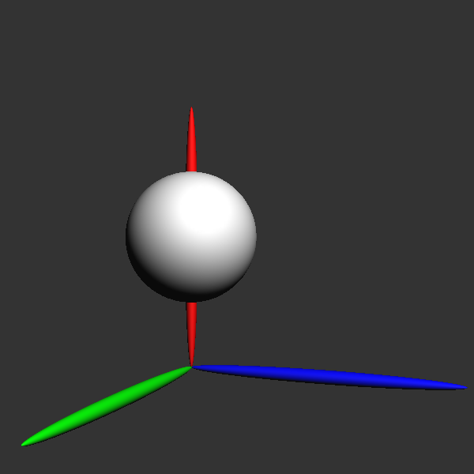
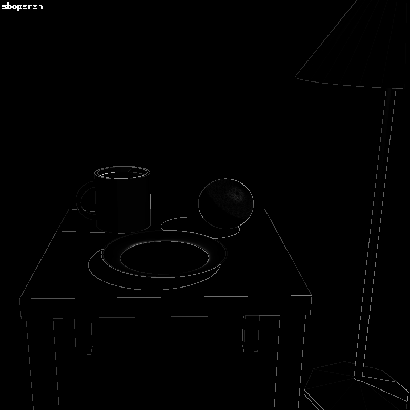
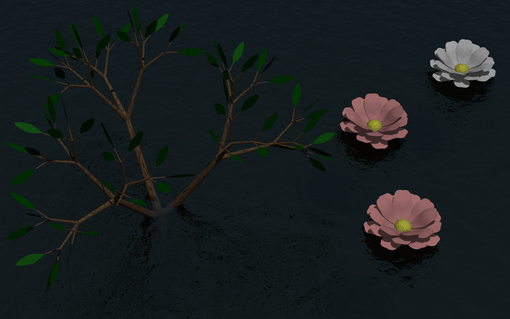

Some images rendered by the programs I wrote while I was taking
[Introduction to Computer Graphics](
https://www.student.cs.uwaterloo.ca/~cs488/).
<!--more-->
Click any image to enlarge.

## Puppet Assignment

We were given the following model as a benchmark to test the
correctness of our transformations.

So I decided to bring it to life as my puppet.
I think it turned out pretty cute, but it's definitely challenging
to model with nothing but spheres!

## Raytraced Images

Here I used data from the anti-aliasing pass to make a visualization
of the edges in the image.
The actual scene isn't that exciting, but I thought that this
visualization looked kind of cool.

As part of the project requirements, we had to render a scene which
used all of the features of our raytracer.
I had fun creating the procedurally generated plants by
using the techniques described in
[The Algorithmic Beauty of Plants](
http://algorithmicbotany.org/papers/#abop).

This last one is my favourite.
It really shows off the caustics we can get by using
[photon mapping](http://graphics.ucsd.edu/~henrik/papers/book/).

