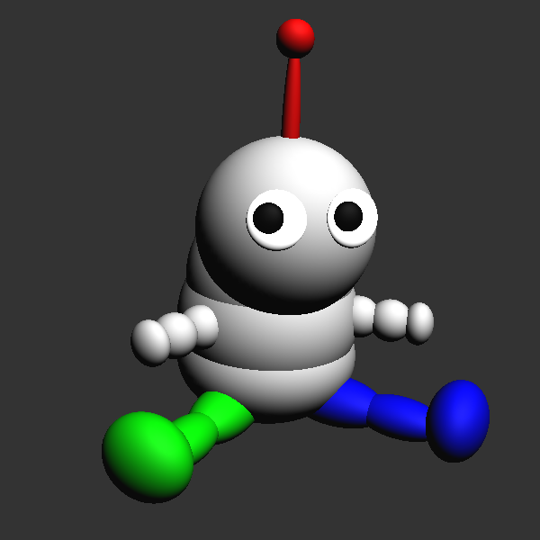

Some images rendered by the programs I wrote while I was taking
Introduction to Computer Graphics.

<!--more-->

Click any image to enlarge.

## Puppet Assignment

For the puppet assignment, I took the benchmark model which was
used to test the correctness of our transformations...

...and turned it into this:

## Raytraced Images

This one is my favourite.
It really shows off the caustics we can get by using photon mapping.

A visualization of the edge detection performed by the anti-aliasing
algorithm.

My final scene, which actually turned out kind of boring.

